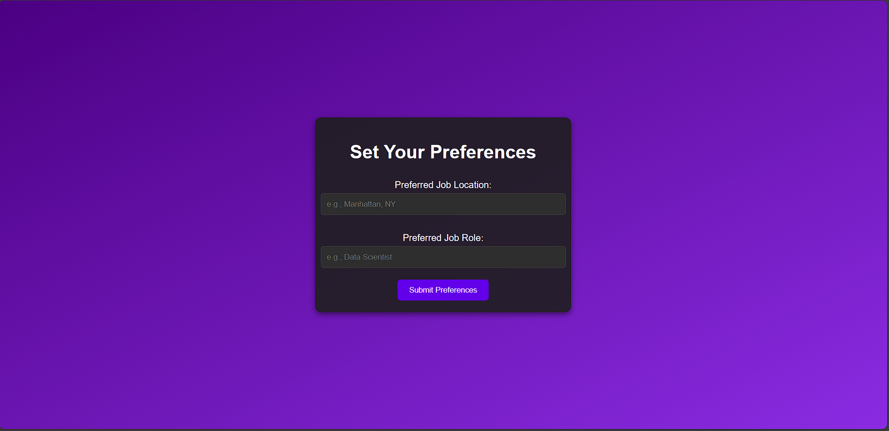
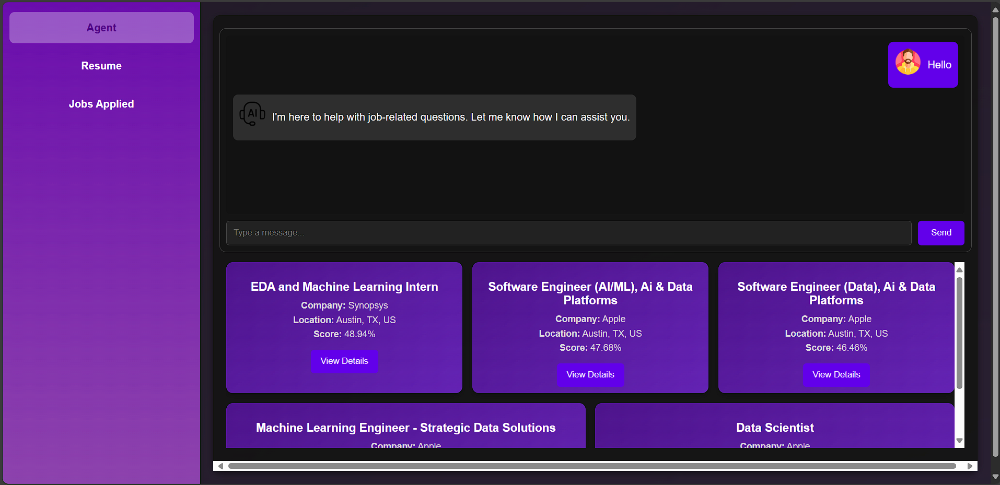
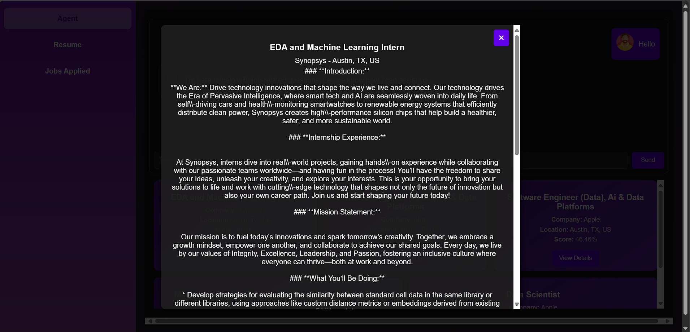
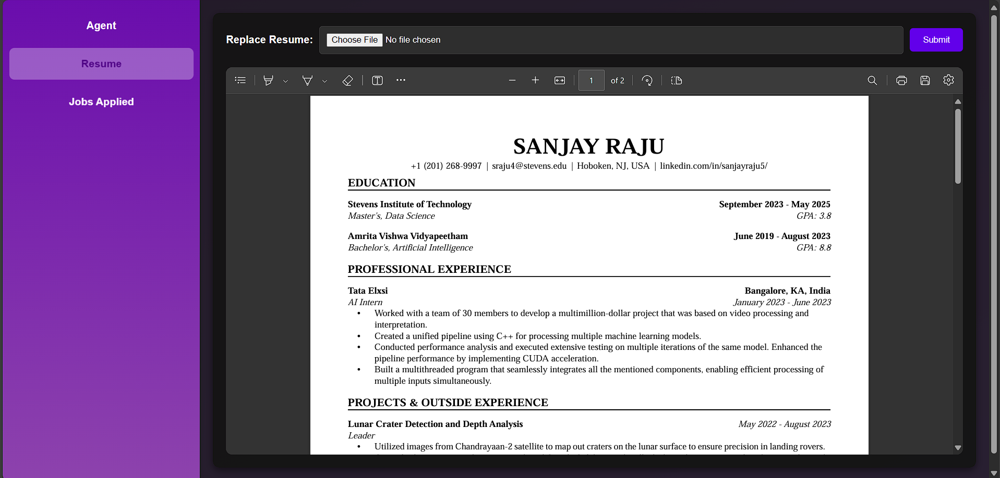
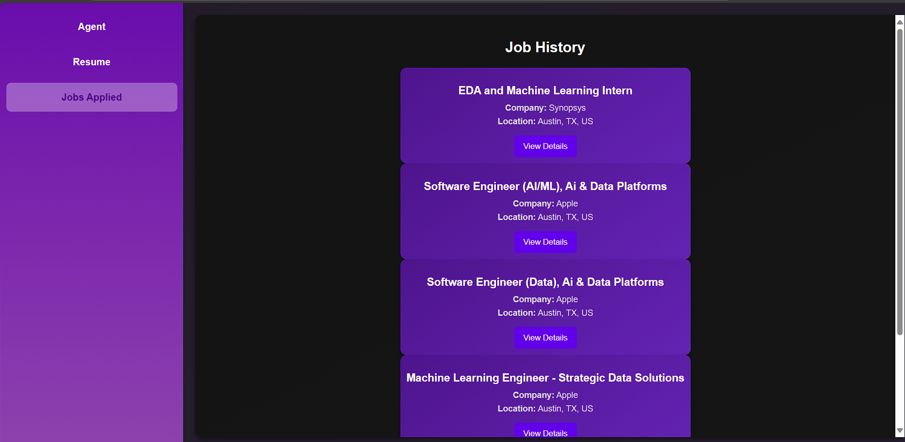
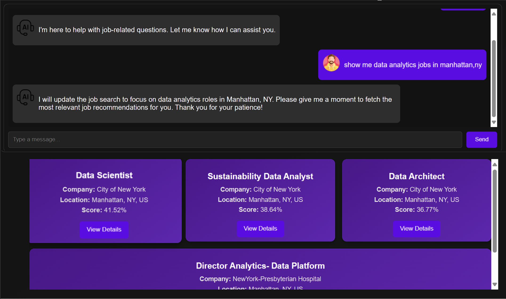

# Automated-Job-Scraper
## Introduction
The **Automated Job Scraper** is a Generative AI agent designed to simplify the job-hunting process. It aggregates job listings from platforms like Indeed based on user-defined preferences such as role, location, and resume skill set. The project leverages advanced scraping techniques and AI-based analysis to provide relevant job listings tailored to the user's profile.

## Getting Started
To set up the project and install the necessary dependencies, follow these steps:
1. Clone the repository:
```
git clone https://github.com/VivekHaridas-01/Automated-Job-Scraper.git
cd Automated-Job-Scraper
```
2. Install the required Python dependencies:
```
pip install -r requirements.txt
```
3. Additionally, install the python-jobspy package (_Python version >= [3.10](https://www.python.org/downloads/release/python-3100/) required_):
```
pip install -U python-jobspy
```
4. Launch the application by running the main script:
```
python app.py
```

## Features

1. **Resume Upload and Parsing**
   - Users can upload their resume in PDF format.
   - The resume is parsed to extract key details like Name, Skills, Work Experience, Education, and more using OpenAI's GPT model.
2. **Job Preferences**
   - Users can specify their preferred job role and location.
   - These preferences are used to filter and rank job listings tailored to the user's profile.
3. **Job Listing Aggregation**
   - Scrapes job listings from multiple platforms (currently using `Indeed`) for the specified job role and location.
   - Supports fetching up to 1000 jobs at a time and avoids duplicate entries.
4. **Resume and Job Matching**
   - Generates embeddings for the uploaded resume and compares them with job descriptions using cosine similarity.
   - Ranks job listings based on their relevance to the resume and user preferences.
5. **Interactive Dashboard**
   - Displays ranked job recommendations along with detailed descriptions.
   - Allows users to save jobs to a history for future reference.
6. **Job History**
   - Maintains a record of viewed and saved jobs, ensuring no duplicate entries.
   - Users can revisit previously recommended jobs anytime.
7. **Resume Replacement**
   - Users can replace their uploaded resume and trigger a re-ranking of job listings based on the new resume.
8. **Chat Assistant**
   - Provides a conversational interface to interact with the job recommendations and resume insights.
   - Answers queries about specific jobs, career advice, and updates search preferences dynamically.
9. **Data Management**
   - Job listings are saved locally in CSV format for easy access and management.
   - Ensures the file size remains optimal by truncating older job entries.
10. **Asynchronous Processing**
    - Scraping and matching operations run in the background to avoid delays in the user experience.
11. **Scalable Design**
    - The modular architecture ensures easy integration with additional job platforms and enhancements.

## Demonstration

Below are key sections of the **Automated Job Scraper** with relevant visuals showcasing the interface and functionality.

### 1. Landing Page
This is the starting page where users can upload their resumes to begin the job scraping process.


---

### 2. Preferences Page
Users can specify their preferences such as **Preferred Job Role** and **Location** to tailor job recommendations.



---

### 3. Interactive Interface
The job agent provides an interactive experience where users can ask questions and browse recommended jobs.



---

### 4. Relevant Job Descriptions
By clicking "View Details" on a job card, users can access a comprehensive job description.



---

### 5. Resume Tab
In the **Resume Tab**, users can view and replace their uploaded resumes.



---

### 6. History of Relevant Jobs
The **Job History** tab displays previously applied or viewed job recommendations.



---

### 7. Interaction Example
An example of a conversation where the agent provides job listings based on the user's query.



---

## Future Updates
- Cleaner UI and output display
- Apply to jobs directly from the UI. Integrate job application history.
- Integrate Scraping from other websites like LinkedIn without limit.

## References
- [JobSpy Github Repository](https://github.com/Bunsly/JobSpy/)
- [OpenAI API](https://openai.com/api/)
